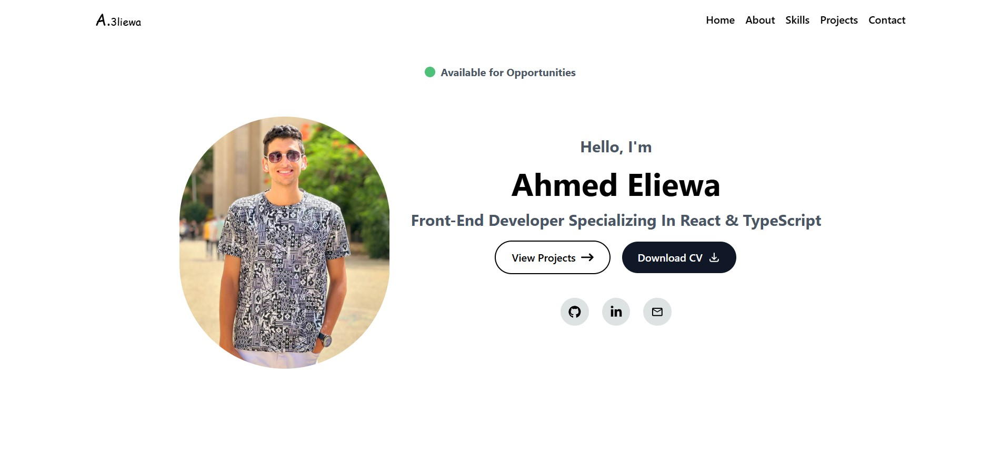
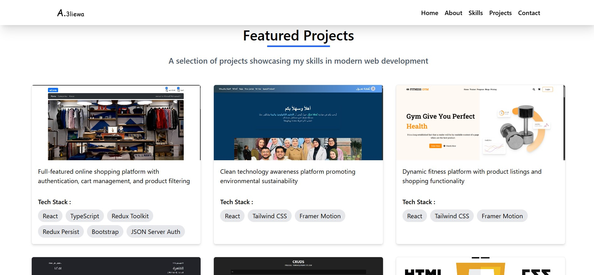

# 👋 Hi, I'm Ahmed Mohamed

Frontend Developer focused on building modern, responsive, and high-performance web applications using **React.js**.

🌐 **Live Portfolio:**  
https://ahmed3liewa.netlify.app/

## 🚀 screen shot

---

## 🚀 About Me
- Frontend Developer specialized in **React.js**
- Strong interest in clean UI, reusable components, and scalable architecture
- Focused on performance optimization and best practices
- Continuously learning and improving modern web technologies

---

## 🛠 Tech Stack
- **Languages:** HTML5, CSS3, JavaScript (ES6+)
- **Frameworks & Libraries:** React.js, Redux Toolkit
- **Styling:** Tailwind CSS, Material UI
- **Build Tools:** Vite, Webpack
- **Version Control:** Git, GitHub
- **Animations:** Framer Motion

---

## 📂 Featured Projects
Some of the projects I’ve worked on:

### 🔹 Project Name
- **Description:** Brief explanation of the problem and solution
- **Tech Stack:** React, Tailwind CSS
- **Live Demo:** Demo Link
- **Repository:** GitHub Repo

> You can find more projects in my repositories section.

---

## 📫 Contact Me
- **LinkedIn:** https://www.linkedin.com/in/ahmed-eliewa16/
- **Email:** ahmedaboeliewa@gmail.com

---

⭐ If you find my work helpful, feel free to star my repositories.
